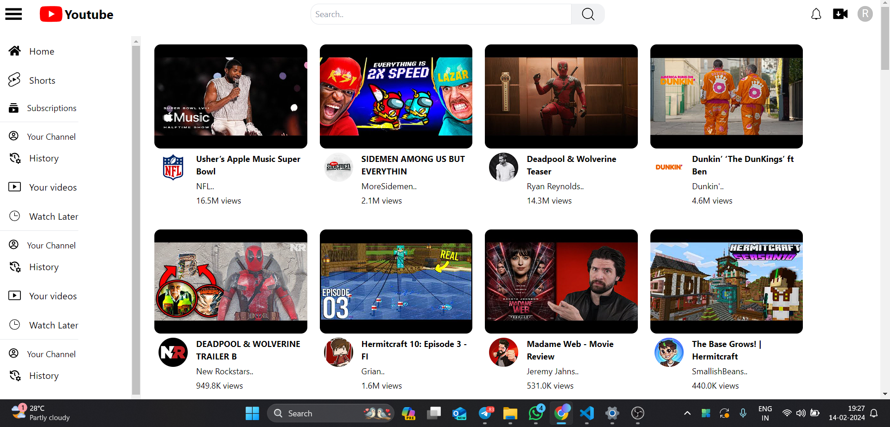
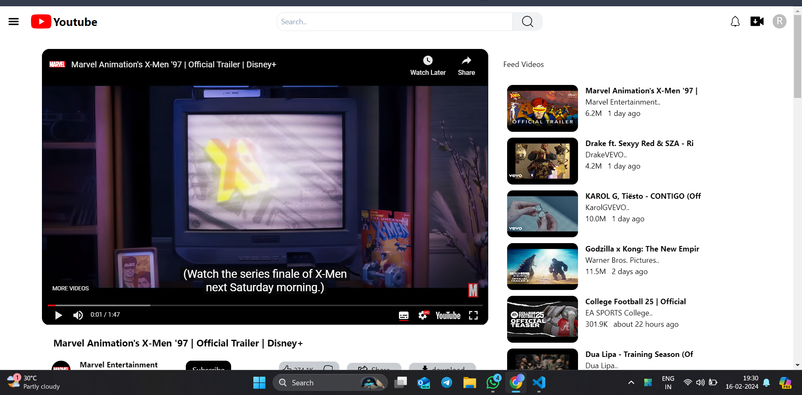
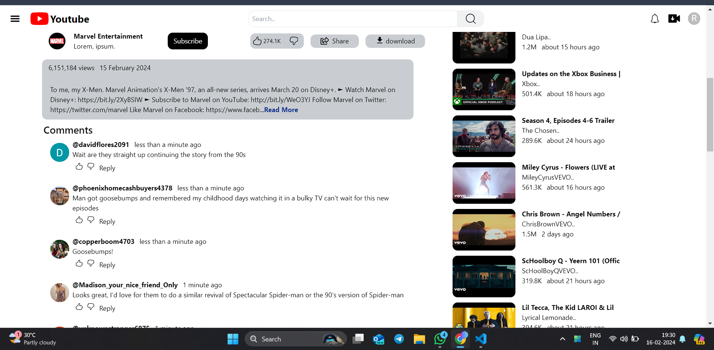

# YouTube Clone App with React, Redux, and Google YouTube API

## Overview

This project is a YouTube clone app created using React, Redux, and the Google YouTube API. It allows users to search for videos, view video details, and play videos within the app. The integration with the Google YouTube API enables the app to fetch real-time data, ensuring an up-to-date and dynamic user experience.

## Features

- **Search Videos:** Users can search for videos using the app's search functionality, powered by the Google YouTube API.

- **Video Playback:** Users can play and watch videos directly within the app.

- **Video Details:** Detailed information about each video, including title, description, and publication date.

- **Redux State Management:** State management is handled efficiently using Redux, providing a scalable and organized structure.

## Technologies Used

- **React:** The frontend of the app is built using React, providing a fast and interactive user interface.

- **Redux:** Redux is employed for state management, ensuring a predictable state container and seamless data flow.

- **Google YouTube API:** The app integrates with the Google YouTube API to fetch video data in real-time.
  ## Screenshots

### Home Page


### Watch Page


### Comments Page


## Getting Started

1. **Clone the Repository:**
   ```bash
   git clone https://github.com/your-username/youtube-clone-app.git
   cd youtube-clone-app
   ```

2. **Install Dependencies:**
   ```bash
   npm install
   ```

3. **Set up API Key:**
   Obtain a Google API key from the [Google Cloud Console](https://console.cloud.google.com/), and replace the placeholder in the app's configuration with your API key.

4. **Run the App:**
   ```bash
   npm run dev
   ```

   The app will be accessible at `http://localhost:3000` by default.

## Configuration

Open the `src/config.js` file and replace the `REACT_APP_YOUTUBE_API_KEY` with your Google YouTube API key.


## Contributing

Feel free to contribute to the project by opening issues or submitting pull requests. Follow the [Contribution Guidelines](CONTRIBUTING.md) for a smooth collaboration process.

## License

This project is licensed under the MIT License - see the [LICENSE](LICENSE) file for details.

## Acknowledgments

- The project was inspired by the functionality and design of the YouTube platform.
- Special thanks to the React and Redux communities for their excellent documentation and support.

---
**Note:** I am currently actively working on this project to enhance its features and address any issues. Your contributions and feedback are highly appreciated!
